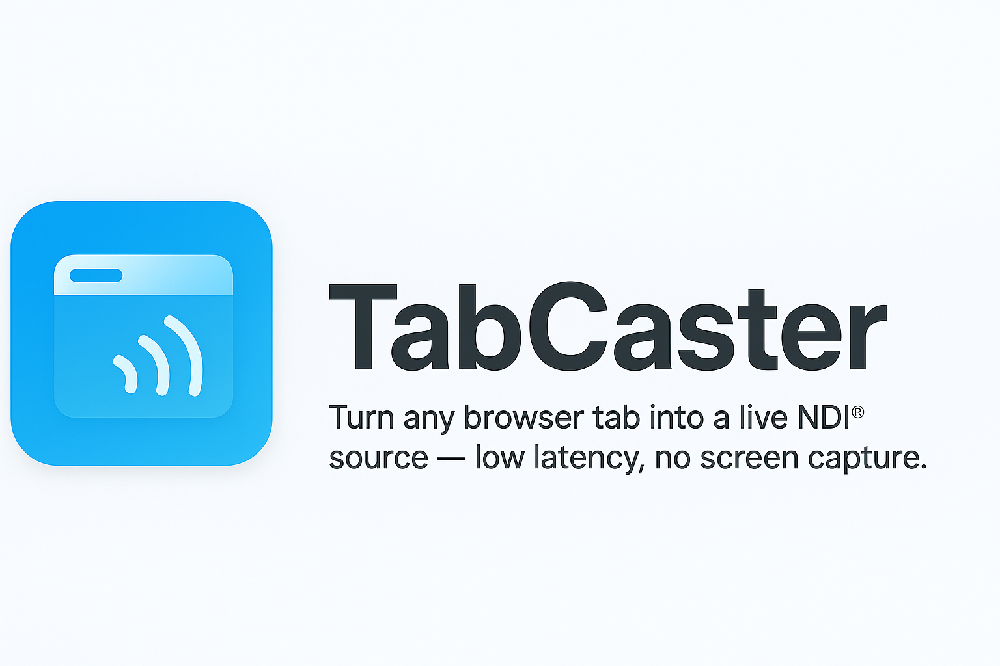

  <picture>
  <source media="(prefers-color-scheme: dark)" srcset="assets/TabCaster_banner-dark.png">
  <source media="(prefers-color-scheme: light)" srcset="assets/TabCaster_banner-white.png">
  
</picture>

<h1>TabCaster</h1>
  
<b>Turn any browser tab into a live NDI® source — low latency, no screen capture.</b>

  
  
  

    
  
   
  <i>Stream web apps, dashboards, or animations into OBS, vMix, or NDI Studio Monitor instantly.</i>

---

# 🛜 TabCaster – Stream Your Browser Tabs to NDI

**TabCaster** transforms any Chromium-based browser tab (Chrome, Edge, or Brave) into a real-time **NDI® source**, allowing seamless integration of web content into professional video workflows — without traditional screen capture or encoding overhead.

> ⚡️ Zero capture. Zero latency. Just pure pixels.

---

## 🌍 Overview

TabCaster bridges your browser and the **NDI 6 SDK**, streaming frames directly from your tab to NDI-compatible apps such as **OBS Studio**, **vMix**, **NDI Studio Monitor**, or **TriCaster**.

It captures frames straight from the browser compositor using `OffscreenCanvas`, bypassing the CPU-heavy screen-capture path.  
The frames are then transmitted to a lightweight native host (built in C++ with the NDI SDK), which broadcasts them as an NDI source on your local network.

---

## 🚀 Features

- ⚡ **Ultra-low latency** NDI output
- 🧠 **Smart frame control** (OffscreenCanvas capture)
- 💻 **Native Messaging bridge** (extension ↔ native host)
- 🔒 **Secure local-only communication**
- 🎛️ Custom resolution and frame rate
- 🧩 100% Chromium compatible (Chrome, Edge, Brave)
- 🪶 Lightweight & efficient – no GPU duplication

---

## 🧠 Requirements

| Component | Version / Notes |
|------------|----------------|
| **Windows** | 10 or 11 (x64) |
| **Visual Studio Community 2022** | Install with “Desktop development with C++” workload |
| **NDI® 6 SDK** | Download from [https://ndi.video/download-ndi-sdk/](https://ndi.video/download-ndi-sdk/) |
| **Google Chrome / Microsoft Edge / Brave** | Any Chromium-based browser |
| **PowerShell** | For registering the native host manifest |

---

## 📂 Project Structure

C:\TabCaster
│
├─ extension\ # Chrome/Edge extension files
│ ├─ manifest.json
│ ├─ popup.html
│ ├─ popup.js
│ ├─ background.js
│ └─ icons
│
├─ host-cpp\ # Native C++ NDI bridge
│ ├─ main.cpp
│ ├─ .vscode\tasks.json
│ └─ build
│
├─ host\ # Optional: Python reference host
│ └─ ndi_host.py
│
├─ register_host.ps1 # Registers Chrome Native Messaging host
├─ com.tabcaster.host.json # Native Messaging manifest
└─ LICENSE

---

## ⚖️ License

This project is licensed under the **MIT License** — see [LICENSE](LICENSE) for details.

**NDI® Notice:**  
This project integrates with the NDI® 6 SDK by Vizrt/NewTek.  
NDI® is a registered trademark of Vizrt. You must download and install  
the official SDK separately from [ndi.video/download-ndi-sdk](https://ndi.video/download-ndi-sdk/).

This repository does not include or redistribute any NDI SDK files.
Users must install the SDK independently before building or running TabCaster.

---

  <i>TabCaster © 2025 – Made with ❤️ and innovation. Thanks be to God.</i>

